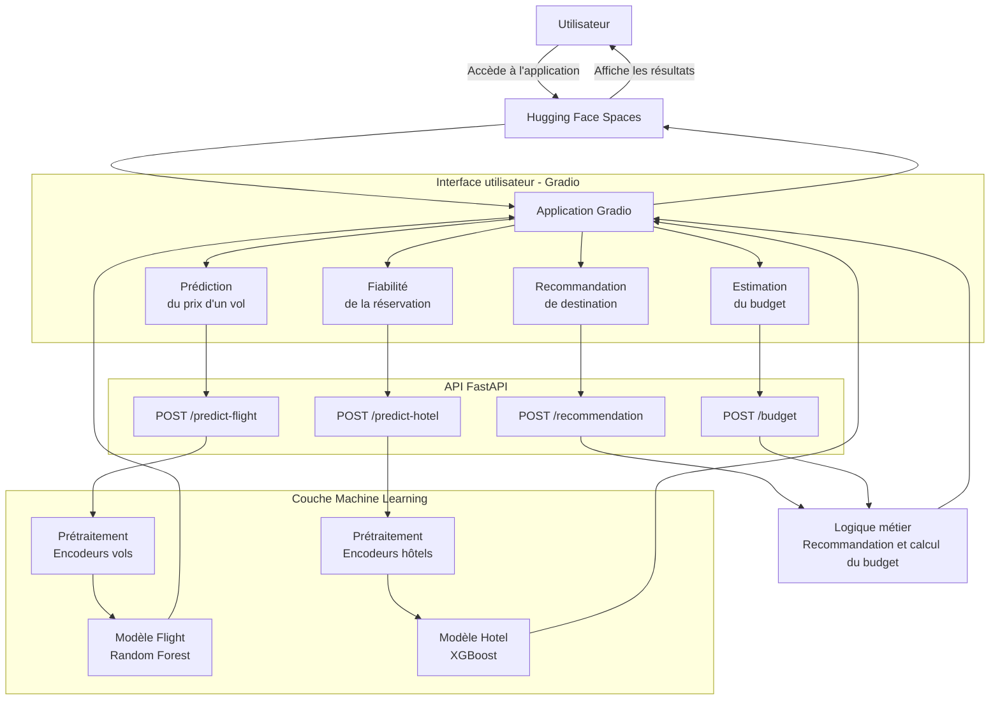

# AI Travel Planner

## Présentation

AI Travel Planner est une application d’aide à la préparation d’un voyage basée sur le Machine Learning.

Elle permet à un utilisateur de :

- prédire le prix d’un vol ;
- vérifier la fiabilité d’une réservation hôtelière ;
- estimer le budget global d’un séjour ;
- obtenir des recommandations de destinations selon ses préférences.

Ce projet a été développé dans le cadre de la constitution d’un portfolio en Data Science, Machine Learning et Intelligence Artificielle.

---

## Démonstration

[Ouvrir AI Travel Planner sur Hugging Face Spaces](https://huggingface.co/spaces/Emilie7/ai-travel-planner)

Documentation interactive de l’API en local :

```text
http://127.0.0.1:8000/docs
```

Interface Gradio en local :

```text
http://127.0.0.1:8000/gradio
```

---

## Fonctionnalités

### Prédiction du prix d’un vol

Le prix d’un vol est estimé selon plusieurs critères :

- compagnie aérienne ;
- numéro de vol ;
- ville de départ ;
- destination ;
- heure de départ et d’arrivée ;
- nombre d’escales ;
- classe ;
- durée du vol ;
- nombre de jours avant le départ.

Le modèle utilisé est un **Random Forest Regressor** optimisé avec `GridSearchCV`.

### Fiabilité de la réservation

L’application estime la probabilité d’annulation d’une réservation hôtelière et retourne un niveau de fiabilité :

- fiabilité élevée ;
- fiabilité moyenne ;
- fiabilité faible.

Le modèle utilisé est un **XGBoost Classifier** optimisé avec `GridSearchCV`.

### Estimation du budget

L’estimation prend en compte :

- le prix des vols ;
- le prix de l’hébergement ;
- le nombre de voyageurs ;
- la durée du séjour ;
- les dépenses quotidiennes ;
- le transport local ;
- les activités ;
- une marge de sécurité.

### Recommandation de destination

Le moteur de recommandation propose jusqu’à trois destinations selon :

- le budget disponible ;
- la durée du séjour ;
- le climat préféré ;
- le style de voyage ;
- l’activité recherchée ;
- la ville de départ.

Cette fonctionnalité repose sur un système de règles transparent appliqué aux destinations compatibles avec les données du modèle de vols.

---

## Architecture

Le projet repose sur une architecture organisée en trois couches principales :

- une interface utilisateur développée avec Gradio ;
- une API FastAPI exposant les différentes fonctionnalités ;
- une couche Machine Learning contenant les modèles et les encodeurs.



## Modèles

### Modèle hôtel

- Problème : classification binaire
- Algorithme final : XGBoost
- Métrique principale : accuracy
- Accuracy sur le jeu de test : environ **84,8 %**
- Validation croisée moyenne : environ **85,3 %**

### Modèle vols

- Problème : régression
- Algorithme final : Random Forest
- Métrique principale : coefficient de détermination R²
- R² sur le jeu de test : environ **98,88 %**
- MAE : environ **879,73 INR**
- RMSE : environ **2 284,95 INR**

Les modèles et les encodeurs sont stockés dans un dépôt Hugging Face dédié :

[Emilie7/ai-travel-planner-models](https://huggingface.co/Emilie7/ai-travel-planner-models)

En local, l’application utilise les fichiers présents dans le dossier `models/`.

Si ces fichiers sont absents, ils sont automatiquement téléchargés depuis Hugging Face grâce à `hf_hub_download`.

---

## API FastAPI

L’API expose les routes suivantes :

| Méthode | Route | Description |
|---|---|---|
| GET | `/` | Vérification de l’API |
| POST | `/predict-flight` | Prédiction du prix d’un vol |
| POST | `/predict-hotel` | Estimation de la fiabilité d’une réservation |
| POST | `/budget` | Estimation du budget du voyage |
| POST | `/recommendation` | Recommandation de destinations |

---

## Interface Gradio

L’interface utilisateur est organisée en quatre onglets :

- Prix du vol
- Fiabilité de la réservation
- Estimation du budget
- Recommandation de destination

Elle est montée sur l’application FastAPI à l’adresse :

```text
/gradio
```

---

## Technologies

- Python
- Pandas
- NumPy
- Scikit-learn
- XGBoost
- FastAPI
- Pydantic
- Joblib
- Gradio
- Pytest
- HTTPX
- Hugging Face Hub
- GitHub Actions

---

## Structure du projet

```text
AI-Travel-Planner/
├── .github/
│   └── workflows/
│       ├── ci.yml
│       └── deploy.yml
├── data/
│   ├── raw/
│   ├── processed/
│   └── destinations.json
├── models/
├── notebooks/
│   ├── 01_exploration_donnees.ipynb
│   ├── 02_preparation_donnees.ipynb
│   └── 03_modelisation.ipynb
├── tests/
│   └── test_app.py
├── app.py
├── gradio_app.py
├── requirements.txt
├── .gitignore
└── README.md
```

Les fichiers `.pkl` du dossier `models/` ne sont pas versionnés sur GitHub en raison de leur taille.

---

## Installation locale

### Cloner le projet

```bash
git clone https://github.com/EmilieMoi7/ai-travel-planner.git
cd ai-travel-planner
```

### Créer un environnement virtuel

```bash
python -m venv .venv
```

Activation sous macOS ou Linux :

```bash
source .venv/bin/activate
```

Activation sous Windows :

```bash
.venv\Scripts\activate
```

### Installer les dépendances

```bash
python -m pip install --upgrade pip
python -m pip install -r requirements.txt
```

---

## Lancement local

### Lancer FastAPI et Gradio

```bash
uvicorn gradio_app:app --reload
```

Interface Gradio :

```text
http://127.0.0.1:8000/gradio
```

Documentation Swagger :

```text
http://127.0.0.1:8000/docs
```

---

## Tests

Les tests automatisés couvrent :

- la route principale ;
- la prédiction hôtel ;
- la gestion des catégories inconnues ;
- la prédiction vol ;
- l’estimation du budget ;
- la recommandation de destination.

Exécution locale :

```bash
pytest -v
```

---

## CI/CD

### Intégration continue

Le workflow GitHub Actions de CI vérifie automatiquement :

- l’installation des dépendances ;
- la syntaxe Python ;
- la validité du fichier `destinations.json` ;
- les tests `pytest`.

La CI est exécutée lors des push sur `develop` et `main`, ainsi que lors des Pull Requests vers `main`.

### Déploiement continu

Après validation de la CI sur la branche `main`, le workflow de déploiement synchronise automatiquement le dépôt GitHub avec le Space Hugging Face.

Le token Hugging Face est stocké dans les secrets GitHub sous le nom :

```text
HF_TOKEN
```

---

## Datasets

Le projet utilise deux datasets principaux :

- Hotel Booking Demand
- Flight Price Prediction

Les données préparées sont stockées dans le dossier `data/processed`.

---

## Limites

- Le modèle de vols est limité aux villes présentes dans le dataset :
  - Bangalore
  - Chennai
  - Delhi
  - Hyderabad
  - Kolkata
  - Mumbai
- Les prix sont exprimés en roupies indiennes.
- Les coûts utilisés pour les recommandations sont indicatifs.
- Le moteur de recommandation repose sur des règles métier et non sur un modèle collaboratif.
- Les prédictions constituent une aide à la décision et ne garantissent pas un prix ou une annulation réelle.

---

## État d’avancement

| Étape | Statut |
|---|---|
| Analyse exploratoire | Terminé |
| Préparation des données | Terminé |
| Modélisation | Terminé |
| Validation croisée | Terminé |
| Optimisation GridSearchCV | Terminé |
| Sauvegarde des modèles et encodeurs | Terminé |
| API FastAPI | Terminé |
| Estimation du budget | Terminé |
| Recommandation de destination | Terminé |
| Tests automatisés | Terminé |
| Interface Gradio | Terminé |
| Intégration continue | Terminé |
| Déploiement Hugging Face | En cours |

---

## Auteur

**Emilie Moissette**